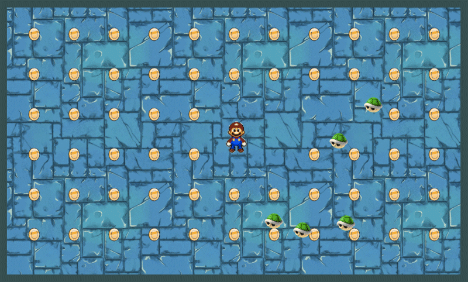

##**Mario Skate**
This was created using Javascript, HTML5 canvas and webpack. The objective of the game is to collect all of the coins while avoiding the bouncing green shells. As you collect coins, more shells will be introduced into the field.

###**Features**
* Using a single frames image, I animated the mario sprite for all eight directions.
* Designed my own logos and many of the character assets using Illustrator and Photoshop.
* The game was built with a responsive CSS design using staggered Media queries.

###**ToDo**
* [ ] Add a Bowser Game Over modal
* [ ] Add a Mushroom Kingdom Victory modal
* [ ] Implement an improved css responsive framework
* [ ] Animate the entry point of the shells with Kupa Cannons, staggered fire.
* [ ] Add level two, FireFlower hunts green shells
* [ ] Add a Bowser Boss Fight
